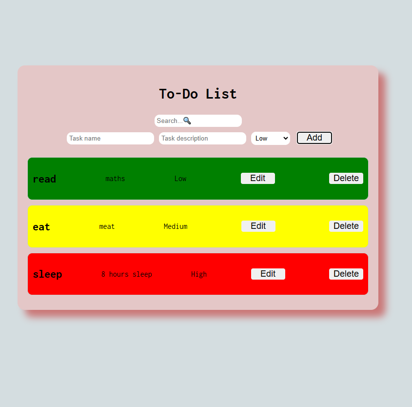

## To-Do List Application
A responsive, user-friendly to-do list application that enables users to manage their tasks with functionalities for login, registration, and CRUD operations on to-do items. This app uses React for the frontend and SQLite for data storage.

## Features
## Pages
Login Page:

Allows registered users to log in with their username and password.
User authentication is implemented to protect data.
Registration Page:

New users can register with a unique username and password.
Validates user input to ensure data integrity.
Home Page:

## Displays the to-do list items.
Users can perform search, add, update, and delete operations on their to-do list.
To-Do List Functionalities
Search: Users can search for items by keyword to quickly locate tasks.
Add New Item: Users can add a new to-do item with:
## Task Description
Priority (High, Medium, Low) with color coding:
High: Red
Medium: Yellow
Low: Green
Delete Item: Remove items from the list.
Update Item: Edit existing items in the list.
## General Requirements
CRUD Operations: Full support for create, read, update, and delete functionalities.
Data Storage: Utilizes SQLite to store user information and to-do list items securely.
Responsiveness: The app is optimized for various devices and screen sizes.
Input Validation: Ensures accurate and error-free data entry.
User Authentication & Authorization: Protects user data and restricts access.
## Tech Stack
 Frontend: 
React.js for building a dynamic user interface.
Backend: SQLite for data storage and user authentication.
Installation & Setup
Clone the repository:

bash
Copy code
git clone https://github.com/yourusername/todo-app.git
cd todo-app
Install dependencies:

bash
Copy code
npm install
Database Setup:

Set up an SQLite database.
Create tables for users and to_do_items based on the provided schemas in the project.
Run the Application:

bash
Copy code
npm start
The application will be available at http://localhost:3000.

## Database Schema
Users Table
Field	Type	Description
user_id	INTEGER	Unique identifier for each user
username	TEXT	Unique username
password	TEXT	Hashed password for security
To-Do Items Table
Field	Type	Description
item_id	INTEGER	Unique identifier for each item
user_id	INTEGER	Foreign key linking to Users
description	TEXT	Description of the task
priority	TEXT	Priority level (High, Medium, Low)
created_at	DATE	Date the item was created
updated_at	DATE	Date the item was last updated

## SCREENSHOTS

## Screenshots

### Home Screen 

*TOdo app running*
